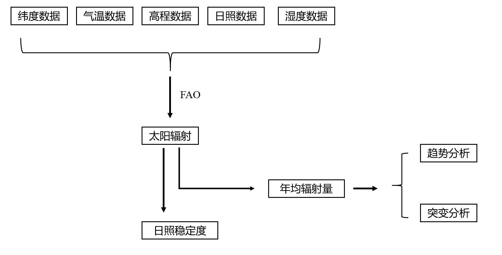
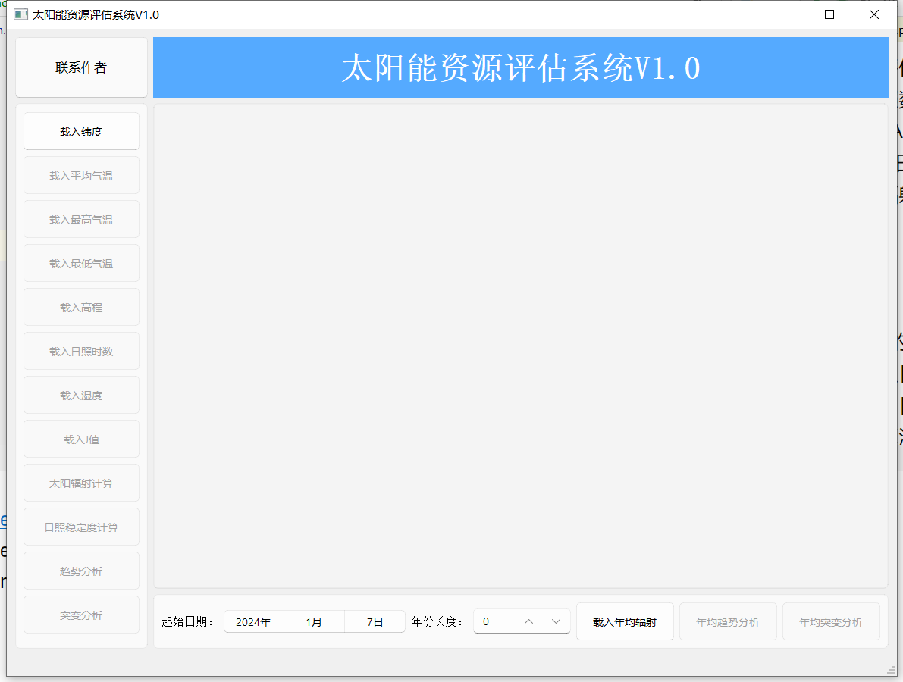

# 太阳能资源评估系统
## 系统概述
太阳能资源评估系统是一种用于评估特定地区太阳能资源潜力的工具。利用气象数据、日照数据等信息估算该地区太阳能的可利用性。本系统利用FAO公式计算太阳辐射量，并利用MK突变分析对年均太阳辐射进行突变分析，利用线性回归的方法计算年均太阳辐射的趋势变化量。
## 系统架构
本软件在基于Python语言，在QT的框架下进行产品开发，适用于多站点太阳辐射量计算以及日照稳定度分析，主要功能包含通过FAO计算太阳辐射、日照稳定度计算、年均太阳辐射突变分析和趋势分析。算法原理见《中国地表太阳总辐射空间化模拟及其时空特征分析》、《中国大陆地表净辐射估算及其时空变化特征》。

## 系统主界面

## 防误触设计
利用按键禁用实现防误触设计，当数据成功导入之后，按键接触禁用
## 通用性设计
增加日期设置，可以使得输入数据不需要设置严苛的yyyy-mm-dd的索引，常数索引也可完成作业
